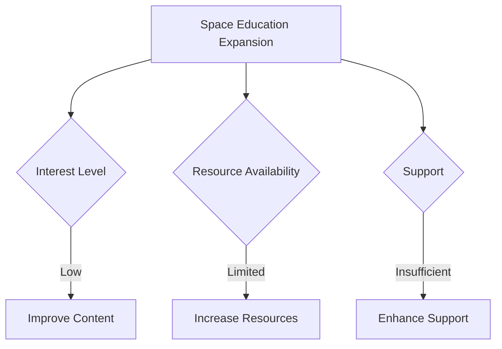

# 1. 概要
「何かを深く考えて理論整然とした主張を導きたい」、「他人に理解されるような説明をしたい」と願うことがあります。
しかも、如何なる事象に対しても論理的に対応できる実力が欲しいと思っています。
この願望を、短期的に解決してくれるツールとして、__ロジカルシンキング__ というものがあります。
日本語でいうと，論理的思考力です．
最近のコンサル本や自己啓発本の多種多様さをみて、多くの人が欲しいスキルであると思います．

私もその力を欲したうちの一人で，いろんな本やフレームワークなどを見てきました．
しかも，私は様々な分野で取り組みを行ってきていて，人工衛星からスタートアップといった領域まで色々挑戦してきました．
その挑戦の過程の中で，汎用的に使えた方法を共有したくて本記事を書くことにしました．

ロジカルシンキング法を使えることによるメリットは，
1. 情報収集や情報整理が，早く＆精度が上がる
2. 資料作成が爆速になる
3. 間違いに気づきやすくなる

と感じています．

本記事では、衛星開発と研究，起業に挑戦をする中で特に重要で、有効だった手法について紹介します。
これらは、単に思考法というだけでなく、プレゼンや問題解決においても非常に有用です。

紹介したい内容は以下の通りです．

- PREP法とTAPS法
- 雲雨傘の論理（SCR Framework）
- 因果と相関
- アナロジー
- 演繹法と帰納法
- 目的ドリブン
- ロジックツリー
- 80:20の法則
- 6W3H
- オジボーンのチェックリスト

# 2. 序論
## 2.1. 背景
昨今，ロジカルシンキングや論理的思考力という言葉を多く聞くようになった．
論理的思考力を持つ人は，考え方が理論整然としていて，言うことが理にかなっているというような印象があります．

論理的思考力というのは限られた人が使える能力ではなく，基本的には誰でも使えるモノです．
web上にもたくさんの情報が落ちていますし，自己啓発本にも大体書いてあります．

そんな論理的思考力ですが，自分のように自分から情報を集めに行く人は周りにはあまりいませんでした．なぜならば，周りは理系の大学院生ばかりで，数学や物理，プログラミングをやっているため，論理的にならざるを得ないからです．

しかし，そんな人たちでも，プレゼンをする際や資料作成をする際，または何かに対して新しく取り組む際などにはロジカルでない部分が出てきました．
これは，__考え方について考えたことがないこと__ が原因だと思っています．自由な発想をしたいとき，本当に自由だと逆に何も考えられないということがあります．矛盾しているように聞こえるかもしれませんが，__制限がある方が自由は発想がしやすい__ のです．

ということで，私はロジカルシンキングを __思考に制限をかけるための方法__　だと思っています．
制限をかけることで，時間をかけずに良い成果を出せるようになるということです．

そんなロジカルシンキング手法について，個人的に実用的であったものを纏めたものが本記事です．

## 2.2. 対象読者 / 適用範囲
### 2.2.1. 対象読者
- 説明上手になりたいエンジニア
- 研究室配属された学生
- 論理的思考力をとりあえず知りたい社会人
- 資料作成の能力を挙げたい人

### 2.2.2. 適用範囲
- 簡単なスライド作成法の記事
- 問題解決法の記事

## 2.3. 目的
本記事は自分が使った上で，有用だったロジカルシンキング手法について紹介する．
そして，今日から使える知識として残したい．よって，以下の目的を設定．

- 実用的なロジカルシンキングの手法を複数挙げる
- それぞれについて説明し，また例示する
- それぞれの手法の関係性についても説明する

## 2.4. 仮定 / 環境
N/A

## 2.5. 略語 / 用語
- 論理的思考力：論理的に考えて物事を整理出来る能力
- ロジカルシンキング：論理的思考力と同じもの．
- ドリブン：～に基づいたなど．データドリブンなどの使われ方

## 2.6. キーワード
PREP，SCR，目的ドリブン，アナロジー，ロジカルシンキング，三角ロジック，三段論法，デカルト，論理的思考力

# 3. 論理的思考力を学ぶ意味
## 3.1. 現状
研究室や職場では，資料作成や問題解決，説明をする機会がとても多い．

## 3.2. 問題
この現状において，以下のような状況に陥っている人を見てきた．

- 本当に考えるべき部分とは違う場所で悩んでいる
- 説明が，論理的に飛躍している or 的を射ない
- 資料にストーリー性がない
- 目的が曖昧で，結論を聞いても何をしたか分からない

## 3.3. 解決法
複雑な事象に対して，論理的に考える枠組みが必要である．
そのためには，考え方や論理展開を自分で評価できるようにする必要がある．
しかし，自由フォーマットに対して自己評価はとても難しいため，論理的に考えることが出来る __フレームワーク__ を用いることで，そのフレームワークに適合できているか否かで，論理的であるか評価する指標を得る．

# 4. 先行事例 / 具体例
自分にとって影響を与えてくれた本を挙げておきます．

https://amzn.to/3SZmkdH

https://amzn.to/49xrHb0

https://amzn.to/4316tQm

# 5. ロジカルシンキング手法
## 5.1. PREP法とTAPS法
まずは，説明する際に有用な手法を説明します．

PREP法は，説得力高く説明する方法です．
PREPは，__Point，Reason，Example，Point__ の頭文字です．
結論（主張）を言ったうえで，その理由を言い，さらに例を出して具体的に説明し，最後に再び結論（主張）を言います．
聞き手は，結論を最初に知ることが出来るので，話を飲み込みやすくなります．

具体例としては，「アウトプットは物事の理解において重要です．なぜならば，アウトプットはインプットした膨大な情報の関係性を構築する必要があるからです．知恵として，体系的に自分のモノにする必要があります．アウトプットする際には，個別の情報どうしを論理的に結び付け，論理の飛躍がないようにコンテンツを作る必要があります．例として，学校の宿題があります．学校で多くの情報を得るわけですが，授業では分かった気になっていることも，宿題に取り組むと分かっていないことに気づくことがあります．これはまだ情報が自分のモノになっておらず，知恵として使いこなせないということです．以上のように，アウトプットすることは物事の理解において重要な働きがあると言えます．」という感じ．

https://x.com/TheWarMonitor/status/1294415195285139461?s=20

PREP法で個人的に難しいと思うのは __「Reason」__ の部分です．なぜなら，理由付けをするためには，論理的な思考をする必要があり，「論理的思考を実現するために，論理的な思考をする必要がある」という循環論法になっているように感じるからです．このReasonの部分に関しては，5.2節で説明する __SCRフレームワーク__ を用いると楽に考えることが出来ます．__理由付け__　をする方法についてそこで学ぶので，この悩みは解決することでしょう．

次に，__TAPS法__ について説明する．これも説明を分かり易くする手法です．
TAPSは，__To Be，As is，Problem，Solution__ です．To Be：理想，As is：現状，Problem：問題，Solution：解決法．要するに，目指す姿と現状を列挙して，その間の差分と原因を説明し，解決法を提示するという手法です．私は，問題報告などの際にこの手法を使っていました．正しい情報が先に分かるというのが聞き手としては嬉しいです．

具体例としては，「本実験において，本当は5つの事柄について検証する必要がありました．しかし，現在2つの事柄について取り組んだ時点で，実験期間の半分が終わってしまいました．どれも同程度重たいタスクであり，このままでは残り2つの事柄しか検証することが難しいと考えます．よって，残り3つの事柄から優先度から2つを選ぶか実験期間の延期を検討させてください．」という感じ．あまり内容はいいものではないですが，思考の流れが分かり易いと思います．

発表などにおいて，歴史の講義などでない限りは，現実時間の時系列でなく，より発表の目的に近い部分から説明した方が分かり易い場合が多いです．
これは5.6節で，__目的ドリブン__ を挙げていますが，目的を常に考えて動くと論理的に考えられます．

一応ほかにも，DESC法などと言ったフレームワークは存在しますが，これは論理的思考力とは少し違う気がするので割愛します．

## 5.2. 雲雨傘の論理（SCR Framework）
情報整理に有用な手法についてここでは説明します．

雲雨傘の論理は，コンサルっぽい問題解決の手法という感じですが，状況整理と理解について有効です．

雲雨傘は以下を意味しています．

- 雲：西の方に黒く厚い雲が見える
- 雨：黒く厚い雲は，雨粒を含む雲であり，今後雨が降る可能性が高い
- 傘：今後出かけるのであれば，傘を持っていく必要がある

後は，これの __アナロジー__ (5.4節で説明)をすることで使えると思います．
しかし，コンサル本などではここで説明を終えるモノもあり，何となく使えるもののもっと定義が欲しいなと思っていました．

そんなときに，McKinseyの __SCR Freamework__ に出会いました（というか，これが雲雨傘の元？）．
以下の記事では，その手法について説明されています．
https://speakingsherpa.com/how-to-tell-a-business-story-using-the-mckinsey-situation-complication-resolution-scr-framework/

SCRは，__Situation，Complication，Resolution__ の頭文字です．それぞれについて説明すると，

- Situation：共通の事実や数字を述べる
- Complication：「事実や数字から導かれる問題」かつ「Solutionで解決される問題」を挙げる
- Resolution：Complicationに対する解決方法やアクションを示す

ということです．ここで重要なのは，__Complication__ の建付けです．直訳すると「複雑さ」なので，単に問題を挙げればいいように思いますが，そうではありません．事実から導かれる問題はとてもたくさんあることでしょう．その中において，Resolutionで主張したい部分に適応する問題を挙げる必要があります．

SCRフレームワークの具体例としては，雲雨傘の論理そのものが挙げられます．

5.1節で説明したPREP法について，ここで補足をします．
私は，__PREPのPとSCRのR，PREPのRとSCRのSC__ が対応していると考えるようにしています．つまり，SCR法を先に結論を言うように変更すれば，論理的思考のフレームワークをそのままPREP法として使えるようになるということです．

よって，実際に私が使っているフレームワークとしては，

1. Point or Resolution
2. Situation
3. Complication
4. Example
5. Point or Resolution

という形です．このフレームワークから気づいてほしいのは，__聞き手は「事実の列挙」だけでは「主張を理解できない」__ ということです．だいたい研究などで論理の飛躍が起こるのはこれが原因だと思います．説明が通じなかった場合は，「事実が共通認識でないか」or「理由付けをしていない」というところを疑うとよいと思います．

また，Situationにおいて，__仮定と定義__ を明確にすることが重要です．大体共通認識でない場合は，専門分野を使ってしまっていたり，宣言せずに仮定をしてしまったりしています．仮定と定義は，節にしようか迷ったくらい重要な要素です．制限が会った方が自由は発想ができるという話をしましたが，仮定と定義によって縛ることで，より考えやすくなっていきます．

## 5.3. 因果と相関
物事の関係性について意識するために挙げました．よく詐欺師が使う手法？で，「数字は嘘をつかないが，嘘つきは数字を使う」ということです．

それぞれについて説明します．
- 因果：原因と結果
- 相関：2つのものが密接に関わり合い，一方の変化が他方の変化を意味するような関係．

有名な例で恐縮ですが，「アイスクリームの売り上げと水難事故の発生件数間には統計的に正の相関関係がある」ということです．
この関係は，アイスクリームの売り上げが高い年は，水難事故の発生件数も多いということです．ここで，「水難事故を増やせば，アイスクリームの売り上げが上がる」と嘘つきがいったとしたとき，正しく反論できるでしょうか．

この問題は実は，その年の気温とそれぞれ2つに因果関係があるため，アイスクリームと水難事故が関係づけられていたのでした．つまり，水難事故のせいでアイスクリームの売り上げが増えるといった因果関係は存在しないわけです．その逆も因果関係はありません．

この例は分かり易く嘘つきが言ったことにしましたが，資料や発表において自分が嘘つきにならないように注意することが重要です．
そして，これは事実（Situation）から理由付け（Complication）を述べる際に重要になってきます．
演繹法的に，事実→理由付け→主張（共通の事実となる）→理由付け→主張　というように因果関係を意識して考えましょう．これは，5.5節で説明する演繹法の三段論法です．（なお，相関が悪いというわけではありません．次の節では，相関を使う方向の内容です．）

## 5.4. アナロジー
物事を整理するときに有用な考え方です．日本語では「類推」です．抽象化，一般化をするイメージです．
多くの事象の中から共通している事象（相関でもよい）見つけることで，対処しやすくなります．

例えば，線形代数の講義では，スカラーとベクトル（行列）をアナロジーしていました．異なる概念なのに，同じように扱えることができるので，全く新規の概念というよりは今までの知識を継承して考えることが出来ます．
全く同じように扱うことはできませんが，ほとんどのことは同じように扱うことが出来るため，スカラーで有効な手法がベクトルでも有効であったりします．
理系の人にはなじみ深い考え方かもしれません．

このように多くの事象から似たことを抜き取って一般化することで，多くのことへの対処法を考えたり，似た性質をもつ事柄で出来ることを適用したりすることで妥当な考え方を出来ます．抽象化として，__アナロジー__ を覚えておくと物事を整理して対処できるようになると思います．

（全然似ていないものに対して，無理やり関係性を作ろうとすると，陰謀論的になるので注意しましょう）

## 5.5. 演繹法と帰納法
思考の流れについて意識するキッカケとして，この2つを挙げました．
2つは混ぜるな危険．

演繹法：抽象→具体
帰納法：具体→抽象

定義から定理を導くときように三段論法を繰り返して導いていくようなものが演繹法．
アナロジーのように具体的な事象を一般的に扱えるようにしていくのが帰納法（数学を例にするなら数学的帰納法）．

試験のまとめなら，帰納法的に考えて，どんな性質だったのかを考えるとよい．
設計や開発などでは，演繹法的に考えて，進めていくとよさそう．

（デカルトとベーコン）

## 5.6. 目的ドリブン
効率よく，分かり易く行動をするなら，目的ベースであるとよいです．
目的が先に決まっていれば，あとは達成するように行動すればよくなるからである．
ゴールなく彷徨っていると，経験値は溜まることがあるが，なかなか実績は得られない．

目的ドリブンというのは，why→what→howというように考える思考法．
__目的__ があって，目的を細分化するように __目標__ があって，目標を達成するために __手段__ があるという考え方．

これは，学校教育のように体系的な講義を受けている人ほど忘れがちな考え方だと思っています．

例えば，本を読むときでも，必要な知識だけを手に入れるという目的であれば，頭から読むよりも目次だけ見て，該当ページを読む方が早く終わる．資格のための勉強なら，最も厚い単元から取り組めば効率よく点を取れるであろう．このように目的をもって，PDCAを回すように行動すると，行動の説明がしやすくなるため，論理的に見える．

ただ一つ断っておくのは，「体系的な知識」があることによって __アナロジー__ がしやすくなるということがあると思う．専門的な技術者の人ほど，新しい技術に対しての理解が早い印象がある．仕事や研究などで，最短時間で成果を上げようというような，環境に最適化することが必要な場面において，目的ドリブンは役に立つと思う．

目的ドリブンにおいて，5.7節のロジックツリーや5.9節のインパクトが大きい部分から取り組むという考えが有用です．

## 5.7. ロジックツリー
抽象→具体化していくために便利なツール．
実は大企業でも使っているし，宇宙関係だとFTA(Fault Tree Analysis)などが多く使われている．
しかし，研究室などではあまり使われているところを見ないので使えるとそれだけで差別化できるかも．

## 5.8. 80:20の法則
## 5.9. 6W3H
## 5.10. オジボーンのチェックリスト

# 6. 結論
## 6.1. まとめ
## 6.2. 展望
## 6.3. その他

# 7. 参考文献